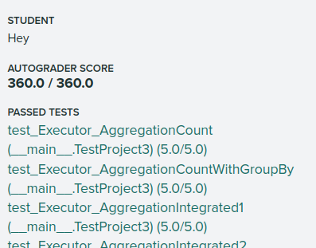

# InserExecutor不会改变结果集
(不止insert，还有update等 。。)

所以在execution_engine.h 添加判断tuple是否真的被分配的逻辑

~~~cpp
    Tuple tuple;  // 这里已经调用了一次默认构造函数，但是分配的空间在栈上，因此不需要delete之类的操作
    RID rid;
    while (executor->Next(&tuple, &rid)) {
    // 注意 ： 这里要判断tuple是否真的被分配
    // insert是不会将tuple赋值的， 所以应该判断元祖是否分配再将它加入结果集中。 insert操作不会改变结果集！
    if (result_set != nullptr && tuple.IsAllocated()) {
        result_set->push_back(tuple);
    }
    }
~~~

` && tuple.IsAllocated()` 是要增加的逻辑

# 内存管理
栈上分配的内存不用管理，因为它们的生存周期是受限的，会被自动释放。而堆上分配的对象必须手动释放或者使用智能指针管理。

说起来很容易，踩坑同样容易。

比如在seq_scan_executor.cpp的Next()方法中， 要将元组拷贝到tuple指针指向的内存中，而不是new 一个对象将指针拷贝给tuple指针。可以看execution_engine.h中，在栈上分配了一个Tuple， 在调用Next方法时，它传入的是栈上这个Tuple的指针，意思是让我们将Tuble构建出来然后复制到栈上相应的位置。
~~~cpp
    // 下面的new 操作会在堆内存中申请空间，但是没有对应的析构函数
    // tuple = new Tuple(values, output_shema_); // 这一行有两个错误，1是没有析构Tuple ，2是没有在给定的地址创建，请见execution.h中的执行代码。 
    // new(tuple)Tuple(values, output_shema_); // 这一行也错，错在在堆上分配对象
    *tuple = Tuple(values, output_shema_); 
~~~

尽量用智能指针管理智能指针，比如 insert_executor.cpp 的初始化方法中，传入的child_executor是智能指针，所以我们也用智能指针管理它，否则会有内存泄漏

# 只有表元组才有RID
RID 是一个元组在数据库中的定位信息， RID由page_id 和 slot_num组成，可以通过RID快速定位一个在表中的元组。

务必区分表元组和一般的元组，比如
~~~cpp
    *tuple = Tuple(values, output_shema_);
~~~
这样创建的元组是没有RID的， 它根本不存在于数据库中，也就没有定位信息。这之后执行的`tuple->GetRid()`得到的是一个非法的RID。如果不注意，会在delete测试中发生错误，因为delete是更具rid定位一条记录的。

# 构造元组
使用某个expression构造元组时，一定要传入相应的schema，否则很容易产生越界错误 

# nested_loop_join
课堂上讲的连接算法是非常简单的：

再一次体会到了理论与实践的差距。它`没有把火山模型考虑`进去： 每一个executor都是调用next来实现的，如果找到一个匹配的元组，那么就要提前return。

但是下一次executor.next时不应该对左表进行迭代，先应该判断右表是否到底，如果右表到底了那么左表迭代一次，并初始化右表。

可能需要在类的成员函数中保存左表的元组 以便NEXT的逻辑无误

注意空表的处理

注意grade_scope线上测试有`IO_cost` 测试，会判断你对两个表的迭代次数是否有误。比如A表10条记录，B表10条记录，那么总共的“IO次数”(应该是算的对两张表调用next总次数) = 10 * 10 = 100。所以也要注意这里的逻辑，我之前写的逻辑迭代了101次（就多了一次），没有通过，下面是通过的代码片段。

~~~cpp
// left_tuple_是类的成员变量保存左表next出来的tuple， 而right_tuple只是在本方法中创建的一个在栈上的临时变量
while (true) {
    bool got_right_tuple = right_executor_->Next(&right_tuple, &right_rid);
    if (!got_right_tuple) {
      // !!!!!右表到底了但是需要先判断左表是否到底，左表到底就直接返回，否则右表会多 next 1次，IO_Cost测试不会通过!!!!!
      
      // 此时需要 先 更新左边元组
      bool got_left_tuple = left_executor_->Next(&left_tuple_, &left_tuple_rid_);
      if (!got_left_tuple) {
        // 说明左表到底了,连接结束
        return false;
      }

      // 右表到底了,初始化右表。再更新右元组
      right_executor_->Init();
      bool right_table_not_empty = right_executor_->Next(&right_tuple, &right_rid);
      if (!right_table_not_empty) {
        // 如果初始化之后还是没有得到tuple，说明右表是空的，直接返回false
        return false;
      }
    }
    // 判断连接条件
    if (plan_->Predicate() == nullptr || plan_->Predicate()
                                             ->EvaluateJoin(&left_tuple_, left_executor_->GetOutputSchema(),
                                                            &right_tuple, right_executor_->GetOutputSchema())
                                             .GetAs<bool>()) {
      std::vector<Value> values;
      auto output_shema = plan_->OutputSchema();
      values.reserve(output_shema->GetColumnCount());
      // 根据两个表的schema构造连接后元组的各个value
      for (uint32_t i = 0; i < output_shema->GetColumnCount(); i++) {
        Value value = output_shema->GetColumn(i).GetExpr()->EvaluateJoin(
            &left_tuple_, left_executor_->GetOutputSchema(), &right_tuple, right_executor_->GetOutputSchema());
        values.push_back(value);
      }
      // 构造一个连接成功的元组
      *tuple = Tuple(values, output_shema);
      *rid = left_tuple_.GetRid();  // 左表的rid
      return true;
    }
  }
~~~

# C++引用
不像Java几乎所有的class objet都是以引用出现， C++想获得一个object引用必须显示申明它，否则会发生拷贝而出错

~~~cpp
      // 注意这里必须是std::vector<Tuple>&，必须取引用而不是复制，否则 在处理重复key时会出错！
      // std::vector<Tuple> tuple_vector = join_map_[left_join_key];  这样就是复制了一个vector
      std::vector<Tuple> &tuple_vector = join_map_[left_join_key];
      tuple_vector.push_back(left_tuple);
~~~

# 总结
难度在源码阅读理解上，许多方法都是有用的，但是官网就是不告诉你，让你自己看和理解。

看了别人的博客记录我才意识到如何使用已给出的方法得到想要的结果，尤其是 aggregate 那一个执行器， 真的不知道怎么搞， 实现逻辑比 nest_loop_join 和 hash_join都要简单。但就是有些方法看不懂。

感觉难度确实比project2小，但还是做了4天左右(当然借鉴了别人的想法)，代码量似乎比project2多一些(grade_scope的project3总分360分)

通过截图 :

