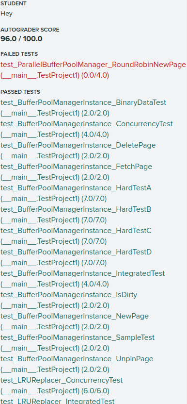
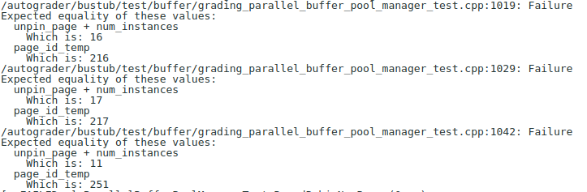
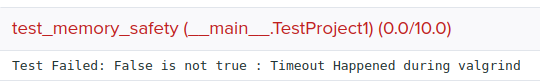
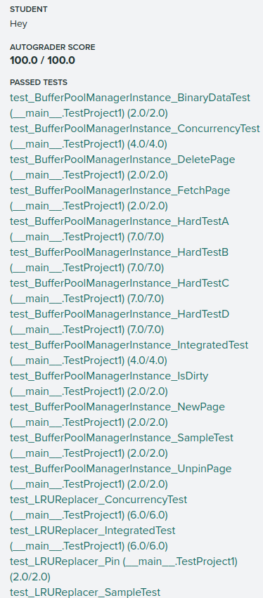

好像看不出啥
本地测试看出来了，就是因为在 newpgimg时，一开始就调用了AllocatePage(),但是失败了却没有回滚，正确做法是在分配成功后再调用AllocatePage()

~~~cpp
Page *BufferPoolManagerInstance::NewPgImp(page_id_t *page_id) {
  // 0.   Make sure you call AllocatePage!
  // 1.   If all the pages in the buffer pool are pinned, return nullptr.
  // 2.   Pick a victim page P from either the free list or the replacer. Always pick from the free list first.
  // 3.   Update P's metadata, zero out memory and add P to the page table.
  // 4.   Set the page ID output parameter. Return a pointer to P.
  latch_.lock();
  // 1. 分配pageid
  // page_id_t page_id_just_allocated = AllocatePage(); //别在这里分配 ！！！ 否则在 ParallelBufferPoolManager的newpage测试中会有很大的pageid
  frame_id_t frame_id_to_place_new_page;
  Page *new_page = nullptr;
  // 2. 找一个空闲的frame
  if (FindFramePageId(&frame_id_to_place_new_page)) {
    // 3. 更新元数据并添加pagetable
    new_page = &pages_[frame_id_to_place_new_page];
    new_page->ResetMemory();
    page_id_t page_id_just_allocated = AllocatePage();
    new_page->page_id_ = page_id_just_allocated;
    new_page->is_dirty_ = false;  // 最后要写回磁盘，所以改成为false
    new_page->pin_count_++;
    // 在pagetable中添加frame_id和page_id的映射
    page_table_[page_id_just_allocated] = frame_id_to_place_new_page;
    // repalcer pin这个页面
    replacer_->Pin(frame_id_to_place_new_page);
    // 4.
    *page_id = page_id_just_allocated;
    // 5.将新页面写回磁盘
    disk_manager_->WritePage(page_id_just_allocated, new_page->GetData());
  }

  latch_.unlock();
  return new_page;
}
~~~

这个改了之后，再提交显示超时，但是测试网站没有任何提示。起初以为是buffer_pool_manager_instance.cpp  parallel_buffer_pool_manager.cpp 的错误。参考别人的代码后，提交了6、7次后，定位到问题出在lru类...

然后就开始比对自己代码与其他人代码的不同，提交了十多次，代码几乎全部改成了参考代码，但依然显示超时。

不报希望地 `make check-clang-tidy`, 修改提交后显示满分了。。。。

具体的语法错误是： size_t capacity_;这个属性没有用到但是初始化了，将他注释然后提交就过了

~~~cpp
 private:
  // https://leetcode.cn/problems/lru-cache/solution/lruhuan-cun-ji-zhi-by-leetcode-solution/
  // front端是新的， back端是旧的
  std::list<frame_id_t> list_;
  std::unordered_map<frame_id_t, std::list<frame_id_t>::iterator> map_;
  // size_t capacity_;  // 这个属性没有用到 // make check-clang-tidy 检测会报错
  std::mutex latch_;
~~~

然后把lru类改成自己的原来版本，没有超时，但是内存检测错误没过

又倒腾了三四次 ,将map_[frame_id] = list_.begin();  改称 map_.insert({frame_id, list_.begin()}); 后满分通过了。

具体原因还不是很清楚，因为我对C++的stl库不是很熟悉

~~~cpp
void LRUReplacer::Unpin(frame_id_t frame_id) {
  std::lock_guard<std::mutex> lock(latch_);
  // latch_.lock();
  if (map_.count(frame_id) == 0) {
    list_.push_front(frame_id);
    //  该写法错误 map_.insert(frame_id, list_.front()); 参考cppreference ，insert
    //  的参数应该是一个std::pair才可以。我靠，vscode竟然不报错！
    // map_[frame_id] = list_.begin(); // 这个写法，test_memory会报错
    map_.insert({frame_id, list_.begin()});
    // latch_.unlock();
  }
}
~~~

满分截图，
