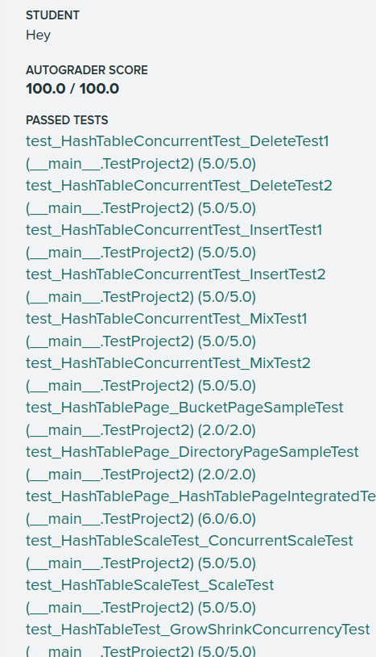
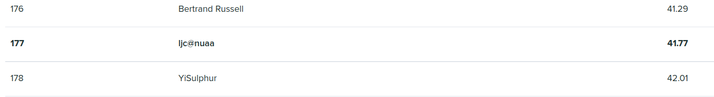

# Build error
很可能是代码风格的问题，我为了这个问题提交了不下15次;
`make format` `make check-lint` 在本地通过后，很玄学的，gradescope竟然没通过。。。只能一点一点比对

还有 `make format` 竟然会对注释掉了的代码进行改动。。。 所以注释掉大片后，一定要再次make format一次

# 超时
这个错误是最烦人的，因为什么输出都没有。最坑人的是，代码风格也可能会造成超时错误

project1 我是大概写了以下 split 的逻辑后进行了第一次提交， 果不其然的是超时。。。

我把锁去掉了，但还是超时。没有办法，我把extendible_hash_table重置成“出场状态”，先测试前一个Task1， 但是buid error了，修改几次后，发现还是代码风格问题

。。。真的很玄学阿， 感觉在代码风格上浪费了太多时间了

另外, 数组越界也有可能会超时错误
~~~cpp
template <typename KeyType, typename ValueType, typename KeyComparator>
bool HASH_TABLE_BUCKET_TYPE::Insert(KeyType key, ValueType value, KeyComparator cmp) {
  int readable_size = sizeof(readable_);
  // assert(readable_size == (BUCKET_ARRAY_SIZE - 1) / 8 + 1);
  for (int array_index = 0; array_index < readable_size; array_index++) {
    char reading_bytes = readable_[array_index];
    for (int byte_idx = 0; byte_idx <= 7; byte_idx++) {
      if (static_cast<bool>(reading_bytes & (0B10000000 >> byte_idx))) {
        // 某一位已经被占用，判断是否重复,使用cmp比较key，使用 == 号比较value
        if ((cmp(array_[array_index * 8 + byte_idx].first, key) == 0) &&
            array_[array_index * 8 + byte_idx].second == value) {
          return false;
        }
        // 不重复则继续寻找下一个空位置
        continue;
      }
      // 找到空位，插入即可
      // LOG_DEBUG("Found free space, array_index = %d, byte_index = %d",array_index, byte_idx);
      array_[array_index * 8 + byte_idx] = std::pair<KeyType, ValueType>(key, value);
      readable_[array_index] = readable_[array_index] | (0B10000000 >> byte_idx);
      // 还要修改 occupied数组,将对应的位置1即可
      occupied_[array_index] = occupied_[array_index] | (0B10000000 >> byte_idx);
      return true;
    }
  }
  return false;
}
~~~
上面的代码, 外层for循环中的结束条件 不小心把等号加上去了, 然后就超时了...

这个BUG也改了很久,不下20次提交

# 一小部分以下部分地去完成和测试
本地的测试完成一个就提交一次， 否则最后一次性提交可能会很难再排查出问题。

两个本地测试其实不用加锁也可以通过，所以可以先把功能实现完成，去gradescope上检测以下(应该能拿30分)，然后再去实现线程安全

# GetSplitImageIndex()
将 bucktindex 的最高位至反即可

这个没想出来，参考别人的才了解的

但是没有按照他的写，自己琢磨了一个

# readable数组是不连续的
在没有 split之前， 某一个bucket中的readable数组确实是连续的，但是在分裂后将bucket的元素rehash后，bucket中的元素就是不连续的了

所以在`hash_table_bucket_page.cpp`中的 insert 逻辑不能查找空位以及判重同时进行

必须先完整扫描bucket中的元素判重， 然后再插入

这个BUG卡了我很久， 线上测试又看不出什么，最后还是自己仿照本地测试进行 splitinsert 后才发现错了

不得不说本地测试是真的有点鸡肋。。。

# SEGV

这个错误具体是说在我执行 IsEmpty() 或者 对bucket 加锁时，会获取`未定义`的页面

发生这个错误的原因大概率是`没有及时unpin不用的页面`

而且在一开始可以设置unping的flag全部为true， 之后为了效率考虑再细化

虽然在这里记录这个bug显得很随意，但是是我调的时间最长的BUG了， 一度想要放弃。之后抱着试试的心态旅顺unpin的逻辑并将 flag改称true后，奇迹般地通过测试了。

# project2 总结
好像有很多要总结的，之后再详细做个笔记吧。

体感project2的难度 与project1的难度 差了一个数量级， 对一个非科班学生来说，第一次正经的CS LAB尝试真的太困难了。DEBUG是一件非常痛苦的事，但是看着gradescope的满分时，还是有满满的成就感。

感谢从gradescope上扒下来测试代码的大佬， 如果不能本地测试，我感觉我一个月也调不出来了。。。

吐槽 ： gradescope的日志输出很有能被截断(truncated)，导致我根本不知道在哪里错了